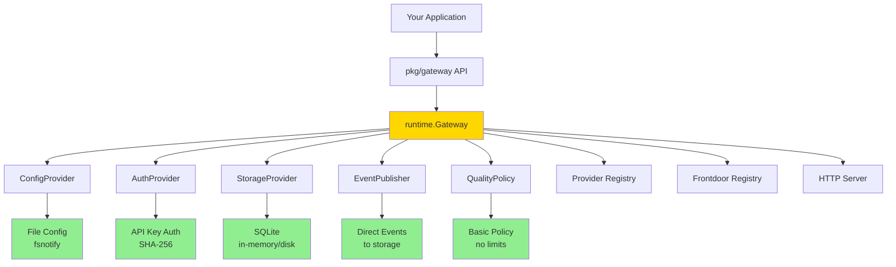

# Polyglot LLM Gateway

A production-ready, **extensible LLM gateway** with pluggable architecture for multi-provider support, multi-tenancy, and advanced request routing.

## ✨ Features

- **Multi-Provider**: OpenAI, Anthropic, and custom providers
- **Multi-Tenant**: API key authentication with per-tenant routing
- **Pluggable Architecture**: Swap any component (config, auth, storage, events, policy)
- **Hot-Reload**: Config changes without restart
- **Shadow Mode**: Run experimental providers in parallel for testing
- **Responses API**: OpenAI-compatible responses for multi-turn interactions
- **Web UI**: Built-in control plane for monitoring (`/admin`)
- **Embeddable**: Use as a library in your own applications

---

## 🚀 Quick Start

### Installation

```bash
git clone https://github.com/tjfontaine/polyglot-llm-gateway
cd polyglot-llm-gateway
```

### Run with Defaults

```bash
# Create config file
cp config.example.yaml config.yaml

# Set your API keys
export OPENAI_API_KEY=your-key
export ANTHROPIC_API_KEY=your-key

# Run the gateway (v2 runtime)
go run ./cmd/gateway-v2
```

The gateway starts on **port 8080** with:
- Config from `config.yaml` (hot-reload enabled)
- SQLite storage at `./data/gateway.db`
- Web UI at http://localhost:8080/admin

### Basic Configuration

`config.yaml`:

```yaml
server:
  port: 8080

providers:
  - name: openai
    type: openai
    api_key: ${OPENAI_API_KEY}
  
  - name: anthropic
    type: anthropic
    api_key: ${ANTHROPIC_API_KEY}

apps:
  - name: openai-api
    frontdoor: openai
    path: /openai
  
  - name: anthropic-api
    frontdoor: anthropic
    path: /anthropic

storage:
  type: sqlite
  sqlite:
    path: ./data/gateway.db
```

---

## 🏗️ Architecture

The gateway uses a **pluggable adapter pattern** with compile-time safe interfaces:



### Extension Points

All components are **swappable via interfaces**:

| Interface | Default | Alternative Options |
|-----------|---------|---------------------|
| **ConfigProvider** | File (YAML) | Remote API, Consul, etcd |
| **AuthProvider** | API Key | OAuth2, OIDC, mTLS, none |
| **StorageProvider** | SQLite | PostgreSQL, MySQL, DynamoDB |
| **EventPublisher** | Direct (sync) | Kafka, NATS, SQS, Redis Streams |
| **QualityPolicy** | Basic (allow all) | Rate limiting, quotas, cost control |

---

## 📦 Using as a Library

Embed the gateway in your application:

```go
package main

import (
    "context"
    "log"
    
    "github.com/tjfontaine/polyglot-llm-gateway/internal/registration"
    "github.com/tjfontaine/polyglot-llm-gateway/pkg/gateway"
)

func main() {
    // Register built-in providers and frontdoors
    registration.RegisterBuiltins()
    
    // Create gateway with options
    gw, err := gateway.New(
        gateway.WithFileConfig("config.yaml"),
        gateway.WithAPIKeyAuth(),
        gateway.WithSQLite("./data/gateway.db"),
    )
    if err != nil {
        log.Fatal(err)
    }
    
    // Start gateway
    ctx := context.Background()
    if err := gw.Start(ctx); err != nil {
        log.Fatal(err)
    }
    
    // Your application logic here...
    
    // Graceful shutdown
    defer gw.Shutdown(context.Background())
}
```

---

## 🔌 Custom Adapters

Implement any interface to extend functionality:

```go
// Example: Custom authentication
type MyAuthProvider struct{}

func (a *MyAuthProvider) Authenticate(
    ctx context.Context, 
    req *ports.AuthRequest,
) (*ports.AuthResult, error) {
    // Your custom auth logic (OAuth, JWT, etc.)
    return &ports.AuthResult{
        Authenticated: true,
        TenantID:      "tenant-123",
    }, nil
}

// Use custom adapter
gw, _ := gateway.New(
    gateway.WithFileConfig("config.yaml"),
    gateway.WithCustomAuth(myAuthProvider),  // Your adapter
    gateway.WithSQLite("./data/gateway.db"),
)
```

See `internal/core/ports/runtime.go` for all interfaces.

---

## 🎯 Use Cases

### Multi-Tenant SaaS
- Per-tenant API keys
- Isolated provider configurations
- Usage tracking and billing

### A/B Testing
- Shadow mode for provider comparison
- Traffic splitting between models
- Performance benchmarking

### Cost Optimization
- Provider failover (primary → backup)
- Smart routing based on model/cost
- Request quotas and limits

### Development
- Local LLM proxy for testing
- Request/response logging
- Mock providers

---

## 📊 Web UI

Access the built-in control plane at **http://localhost:8080/admin**:

- System stats and metrics
- Interaction history and logs
- Shadow mode results
- Provider/tenant configuration
- GraphQL playground

---

## 🛠️ Development

### Run Tests

```bash
# All tests
go test ./...

# Specific packages
go test ./internal/adapters/...
go test ./internal/runtime/...
```

### Build

```bash
# Build v2 binary
go build -o bin/gateway ./cmd/gateway-v2

# Run
./bin/gateway
```

### Docker

```bash
docker build -t poly-llm-gateway .
docker run -p 8080:8080 \
  -e OPENAI_API_KEY=your-key \
  -v $(pwd)/config.yaml:/config.yaml \
  poly-llm-gateway
```

---

## 📖 Documentation

- **Architecture**: See `internal/runtime/` for core implementation
- **Interfaces**: See `internal/core/ports/runtime.go` for extension points
- **Adapters**: See `internal/adapters/` for default implementations
- **Tests**: See `*_test.go` files for usage examples

---

## 🤝 Contributing

Contributions welcome! The v2.0 architecture makes it easy to add:
- New provider types (see `internal/provider/`)
- New frontdoors (see `internal/frontdoor/`)
- New adapters (implement `ports.*` interfaces)

---

## 📝 License

See [LICENSE](LICENSE) file.
